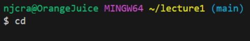
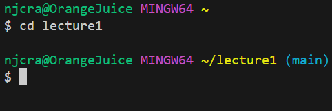
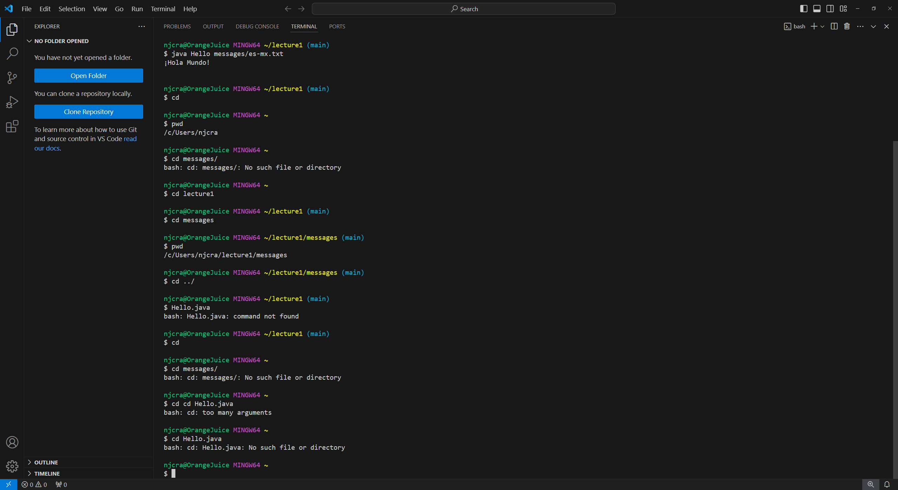
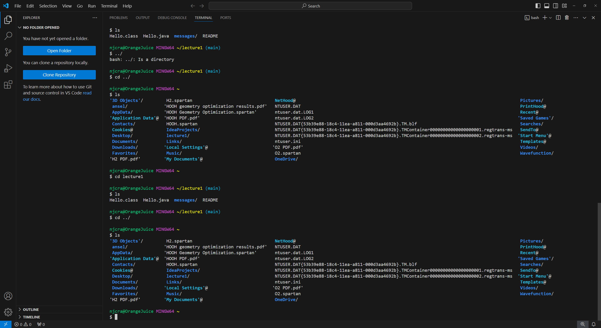
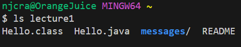
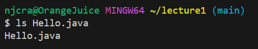
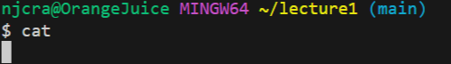
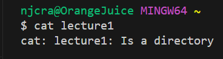
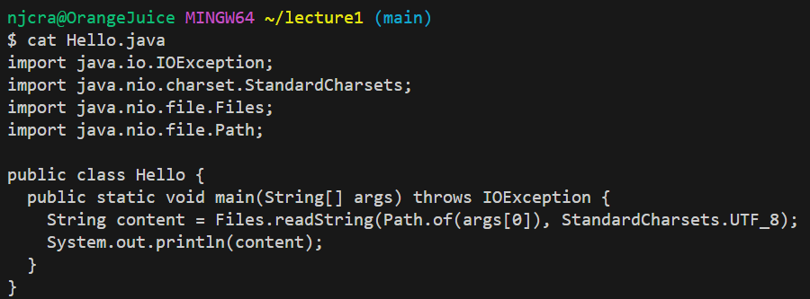

For `cd`:
1. `cd` with no argument:

- Before the command was executed my absolute path to the working directory was: `/c/Users/njcra/lecture1`
- When using cd with no arguments, it will always take you to the home directory.  Instead of `/c/Users/njcra/lecture1`, it would not just be, `/c/Users/njcra/`.
- The output was not an error because all that cd can do when it has no arguments is return you to the home directory.  Thus there will not be an error when entering this command.

2. `cd` with 1lecture11 as its argument:

-Before the command was executed my absolute path to the working directory was: `/c/Users/njcra/` as we are still in the home directory after doing `cd` previously.
- By executing `cd lecture1`, we are changing our working directory to `lecture1`.
- The output in this case will not be an error because we are changing our working directory from `/c/Users/njcra/` to `/c/Users/njcra/lecture1/` which is what the `cd` command is supposed to do when given a directory as an argument.  Since we previously cloned lecture1 into our repository prior to this, we are able to access it with `cd`.

3. `cd` with `Hello.java` as its argument:

- Before the command was executed my absolute path to the working directory was `/c/Users/njcra/lecture1`.
- The output for this command is an error `cd: Hello.java: No such file or directory` because `cd` expects a directory path as its argument, and not a file.

For `ls`:

1. `ls` with no arguments:

- Before the command was executed the absolute path to the working directory was `/c/Users/njcra/`.
- The output provided all of the files and folders that were found in our home directory, `/c/Users/njcra/`.  Since there were no paths provided for it to specifically list out, it defaults by listing out the contents of `/c/Users/njcra/`.
- There was not an error given in this command as ls does not require a specific path to run, it can run without any arguments

2. `ls` with `lecture1` as its argument:

- Before the command was executed the absolute path to the working directory was `/c/Users/njcra/`.
- The output was not an error and provided the contents of our path, `lecture1`.  This includes all of our files such as, "`Hello.class`, `Hello.java`, `messages/`, and `README`.  The reason this is our output is because the ls command will display all of the files and folders in the path given as the argument.  Since `lecture1` was our argument, it listed out all of its files.  (not an error)

3. `ls` with `Hello.java` as its argument:

- Before the command was executed the absolute path to the working directory was `/c/Users/njcra/lecture1`.
- The output did not throw an error and displayed the name of our file (the argument).  When giving ls a file as an argument, as long as it can be located in the working directory, it will simply display back the name of the file.

For `cat`:

1. `cat` with no arguments:

- Before the command was executed, the absolute path to the working directory was `/c/Users/njcra/lecture1`.
- The output did not throw an error because `cat` is used to print the contents of files and since we provided none it will just output nothing.

2. `cat` with `lecture1` as its argument:

- Before the command was executed, the absolute path to the working directory was `/c/Users/njcra/`.
- The output throws an error because we input a directory instead of a file.  the `cat` command is meant to print the contents of files, it cannot work correctly with a directory as its argument.

3. `cat` with `Hello.java` as its argument:

- Before the command was executed, the absolute path to the working directory was `/c/Users/njcra/lecture1`.
- The output prints out the code that was made inside of the `Hello.java` file.  Since `Hello.java` is a file, and not a directory, the `cat` command is able to print out its contents.  

   
