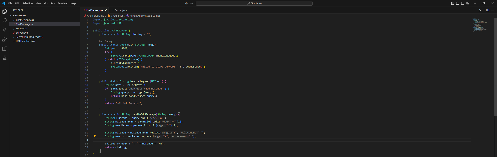
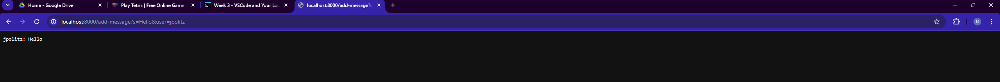
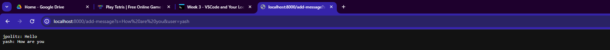
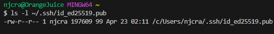
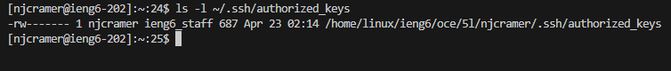
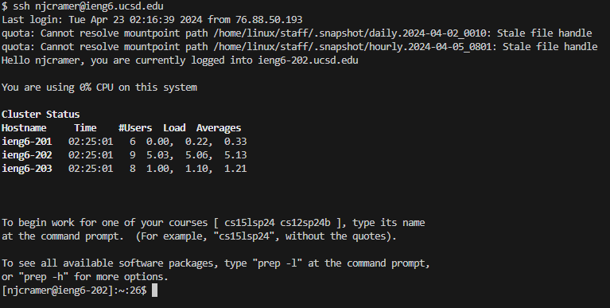

PART 1
`ChatServer.java` 

- Using `/add-message?s=Hello&user=jpolitz`

1. Which methods in your code are called?
   - `handleRequest(URI url)` This is called because our server was receiving a HTTP request
   - `handleAddMessage(String query)`: Since the path in the request matched our `/add-message` format in our code, this method will be executed to add the new message.

2. What are the relevant arguments to those methods, and the values of any relevant fields of the class?
   - For `handleRequest(URI url)`: The argument is the URI of the request which will include the `path` `/add-message` and the `query`, which in this screenshot is `s=Hello&user=jpolitz`
   - For `handleAddMessage(String query)`: The argument used for this method is the query in the request `s=Hello&user=jpolitz` which will be used to process the user and the message.
       - The relevant field in this method is `chatLog` which is a `static String` that will contain the chat history by adding each add request that gets sent.  

3. How do the values of any relevant fields of the class change from this specific request? If no values got changed, explain why.
     - For `chatLog`: Since this was our first request since starting the server, this field would be empty as nothing had been sent for it to store.  After processing the request in the screenshot, the `chatLog` field will not contain "jpolitz: Hello\n".

- Using `/add-message?s=How are you&user=yash`
  

  1. Which methods in your code are called?
     - `handleRequest(URI url)`: Like before, this method will be called as the server is sreceiving a HTTP request.
     - `handleAddMessage(String query)`: Like, before this method will be called because the request sent to our server matches the format `/add-message`, which tells it to run this method to add the messge to `chatLog`.
  2. What ar the relevant arguments to those methods, are the values of any relevant fields of the class?
     - for `handleRequest(URI url)`: the argument is our URI, `http://localhost:8000/add-message?s=How are you&user=yash`
     - For `handleAddMessage(String query)`: the argument is the query string `/add-message?s=How are you&user=yash`
         - The relevant field again is `chatLog` which holds the chat history of our server requests.
  3. How do the values of any relevant fields of the class change from this specific request? If no values got changed, explain why.
     - For `chatLog`: this field would be appended to now also contain our new message.
     - It would not contain "jpolitz: Hello\nyash: How are you\n"

  PART 2
  1. On the command line of your computer, run `ls` with the absolute path to the private key for your SSH key for logging into `ieng6`
     
  2. On the command line of the ieng6 machine, run `ls` with the absolute path to the public key for your SSH key for logging into `ieng6` (this is the one you copied to your account on `ieng6` using `ssh-copy-id`, so it should be a path on `ieng6`'s file system).
     
  3. A terminal interaction where you log into your `ieng6` account without being asked for a password.
     

  PART 3
  1. In 2-3 sentences, describe something you learned from lab in week 2 or 3 that you didn't know before.
     - One of the main things that I learned this week in lab was how  to open servers and use `localhost:` to manipulate it by doing things such as adding `Strings`.  The important part of learning these concepts in lab for me was learning the formatting for things such as `add-message?s=string` in which it needs to be typed exactly in this way in order for the request to succesfully be processed.
     
