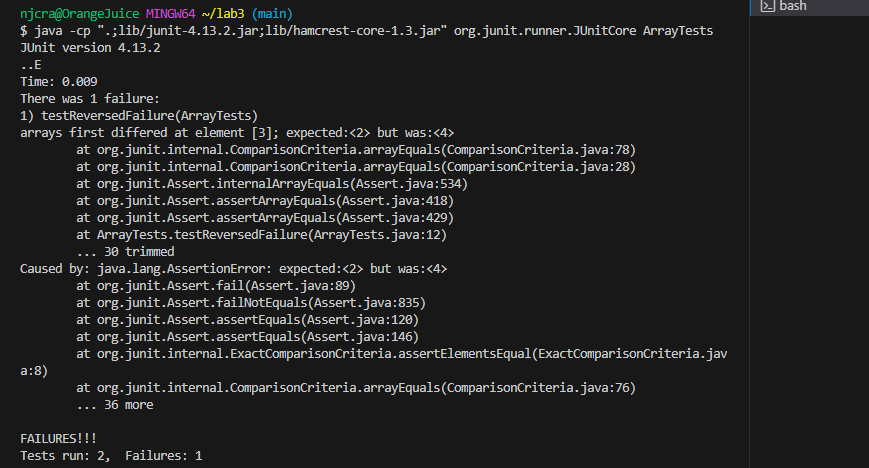
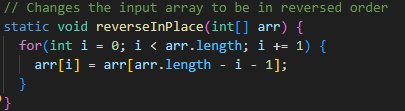
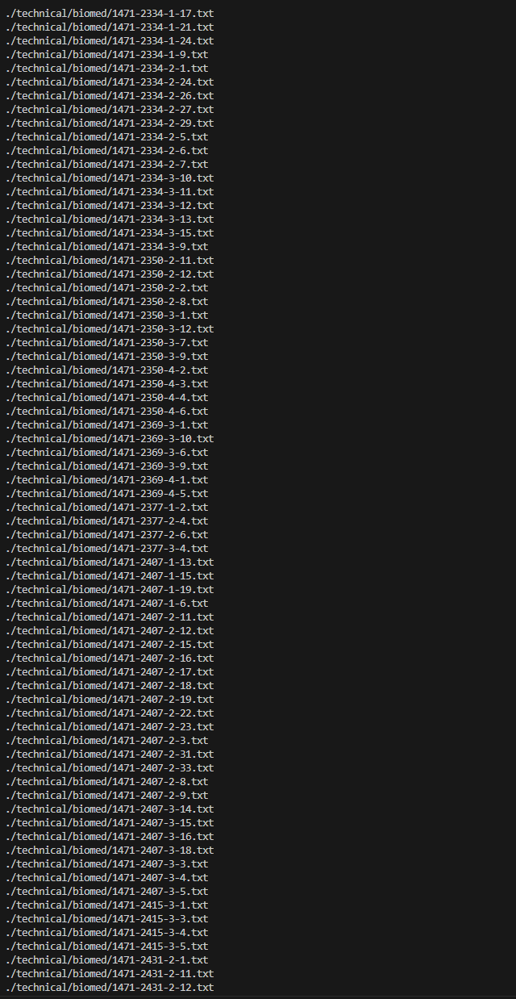
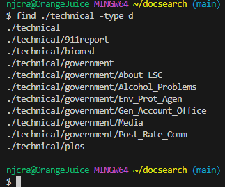
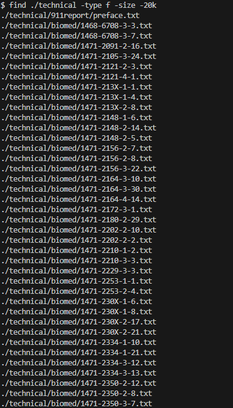
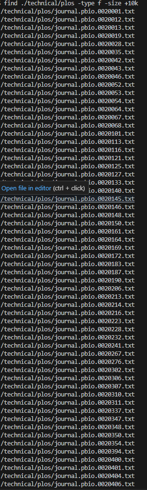
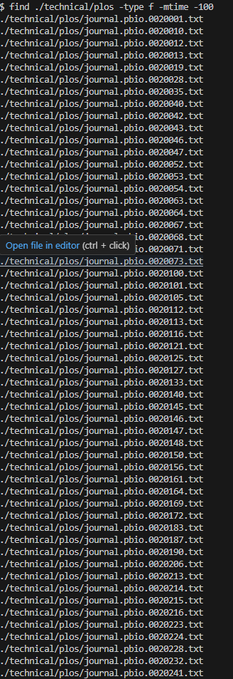
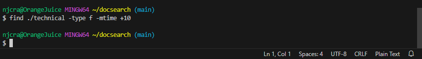
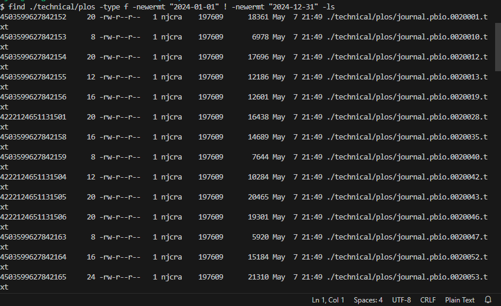
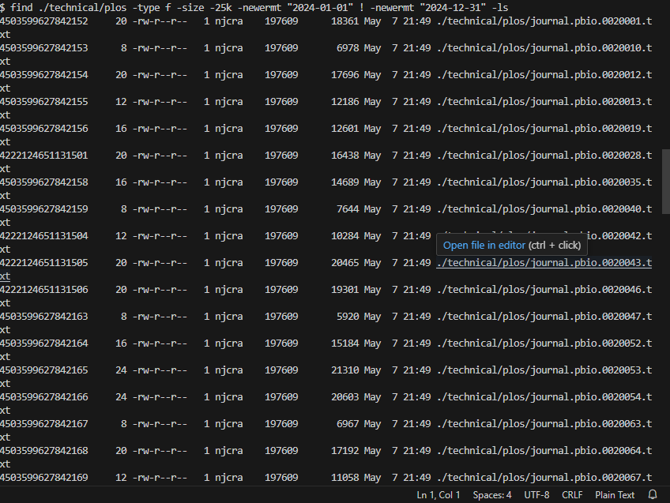

PART 1
1. Code for failure-inducing output:
   `@Test
  public void testReversedFailure(){
    int[] arr = {1,2,3,4,5};
    int[] expected = {5,4,3,2,1};
    ArrayExamples.reverseInPlace(arr);
    assertArrayEquals(expected, arr);
  }`

2. code for success-inducing output:
   `@Test
  public void testReversedSuccess(){
    int[] arr = {0,1,0};
    int[] expected = {0,1,0};
    ArrayExamples.reverseInPlace(arr);
    assertArrayEquals(expected, arr);
  }`

3. Symptom screenshot:

    

4. Buggy code:

   

   Fixed code:

   

5. The fix I made in the code works because the loop will now iterate over the whole array.  It will store the values of `arr[arr.length -i -1]` in a temporary variable which will then be assigned to `arr[i]`.  This will make it so that in the changed array, the order correctly reverses as the 1st element will be the last and so on.

PART 2
1. `-type`
   a) `find ./technical -type f`

    

   This command is useful if you need to search for regular files within a directory/subdirectories.
   
   b) `find ./technical -type d`

    

   This command is useful if you want to be able to search for a specific subdirectory in the directory ./technical.

   Source of info: https://www.gnu.org/software/findutils/manual/find.html

2.`-size`
   a) `find ./technical -type f -size -20k`
 
   
   
   This command is useful if you need to find a file in a directory that is smaller than a specific size.  

   b) `find ./technical -type f -size +10k`
  
   
   
   This command is useful because you are able to search for the files that are larger than a specific size.

   Source of info: https://snapshooter.com/learn/linux/find

3. ` -mtime`
   a) `find ./technical/plos -type f -mtime -100`

    

   This command is useful if you are trying to find files that were edited within a specific number of days.

   b) `find ./technical/plos -type f -mtime +10`

   

   this command is useful if you are trying to find files in a directory/subdirectory that were edited more than x number of days ago.

Source of info: https://www.gnu.org/software/findutils/manual/find.html

 4. `-newermt`
    a) `find ./technical/plos -type f -newermt "2024-01-01" ! -newermt "2024-12-31" -ls`

     

    this command would be useful if you were trying to find a file that was edited within two dates

    b) `find ./technical/plos -type f -size -25k -newermt "2024-01-01" ! -newermt "2024-12-31" -ls`
  
    

    This command is very similar to the previous example, but would help if you needed to also find a file that was within       the searched for time period and under a certain size.

    Source of info: https://unix.stackexchange.com/questions/169798/what-does-newermt-mean-in-find-command
