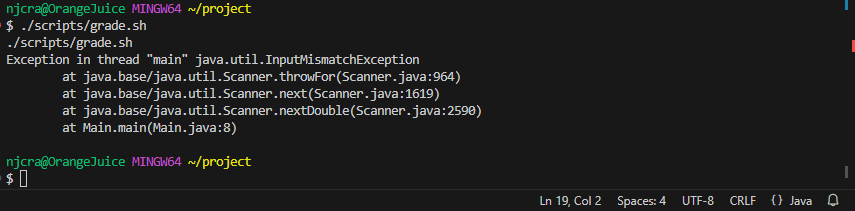
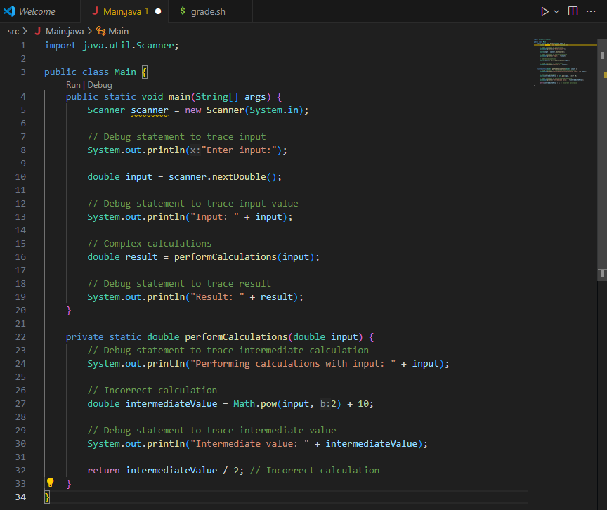
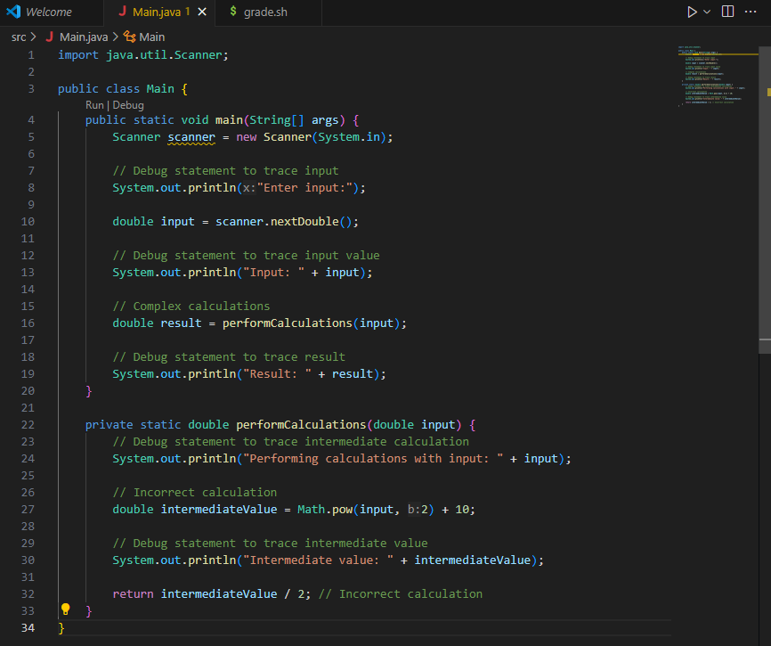
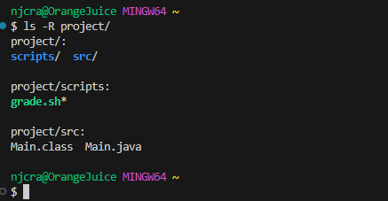
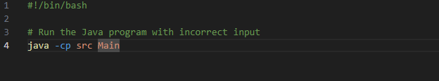
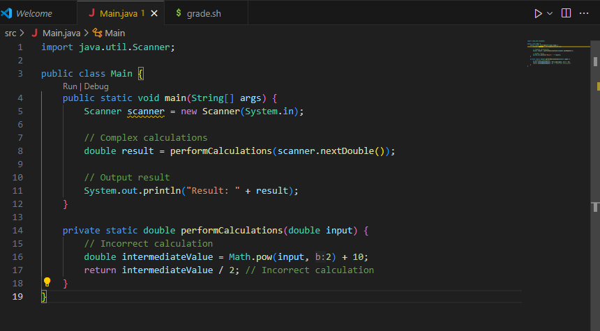

PART 1

1. Student: Hi, I am working on a java file and a bash script that should be capable of computing some calculations.  However, when running the program it fails and throws and exception.

I suspect that the error is related to how the input data is being handled.

2. TA: Based on the unexpected output you gave, it may be easiest to debug your code by printing out intermediate values.  It also may help to trace the flow of the data through the program if that is what you suspect
   the source of the issue to be.  

3. Student: I added some debugging statements that showed the flow of the data as it went through my program, and discovered that the bug came from the logic of my calculations.  I changed some lines in my code
   to handle floating-point numbers.  When running it without the bash script I was able to identify the flaw and now it successfully compiles and provides the correct output.  

 

4.  a) File and directory structure:
   

    b) Contents of grade.sh:

    

      Contents of Main.java:
    

    c) Command line used to trigger error:
      `./scripts/grade.sh`

    d) The main issue with our calculations is that in our original Main.java file the calculation added 10 in one of the lines when it should have subtracted it.  This led the program
    to be unable to properly calculate and threw the error instead.  To solve this, the calculation was swapped to be -10.  When recompiled, this allowed the program to run successfully
    and output the correct value.  

    PART 2

    In the second half of this quarter, the main things I feel that I learned from lab was how to effectively use the terminal.  I feel that in the first half of the quarter, I spent most of
    my time trying to learn just the basics of the terminal.  However, later on I learned that you can do essentially every part of coding through the terminal alone.  I found it to be so helpful
    to use Vim to edit my files.  
