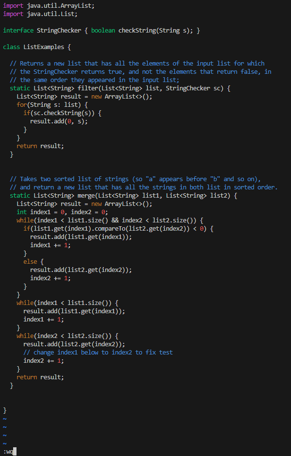
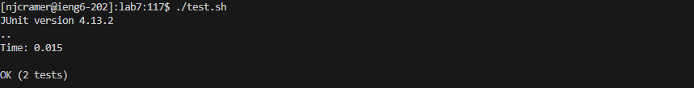

1. Logging in to ieng6
a) 
b) ssh<space>njcramer@ieng6.ucsd.edu<enter>
c) Use the `ssh` command to log into the ieng6 account.

2. Cloning the forked repository
  a) 
  b) git<space>clone<space>git@github.com:HaonremarC/lab7.git<enter>
  c) Use the `git clone` command to clone our forked repository for `lab7`.
  d)
  e) cd<space>lab7<enter>
  f) This step changes our directory to be `lab7`

3. Running `test.sh`
  a) 
  b) chmod<space>x<space>test.sh<enter>
   c) Using the `chmod` command to make the test.sh file executable.
  d) ./test.sh<enter>
  e) this command runs our test.sh file and reveals that one of our tests fail, but the others pass.

4. Using vim to fix the `ListExamples.java` file 
   a) 
   b) vim<space>ListExamples.java<enter>
      /index1<enter>
      `n``n``n``n``n``n``n``n``n`
      cwindex2<esc>
      :wq<enter>
   c) Use the `vim` command to open the `ListExamples.java` file, then we can use a search method by using /index1 to highlight all instances
      in our code where index1 is referenced.  Then we can use `n` until our cursor is over the `index1` instance that needs to be changed to index2.
      Now we can use the `cw` command to delete the `index1` and type in `index2` then hitting <esc> to save it.  To save and exit the vim for this file,
      we can use the command `:wq`.

   Rerunning tests to ensure they pass
   a) 
   b) ./test.sh<enter>
   c) This command will rerun our test and output that all of them pass now that we have changed our ListExamples.java file.

   Commiting and pushing our changes
   a) 
   b) git<space>add<space>ListExamples.java<enter>
      git<space>commit<space>-m<space>"Fixed<space>the<space>bug<space>in<space>ListExamples.java"
      git<space>push<space>origin<space>main<enter>
   c) The `git add` command is used to select which file's changes I am going to commit.  Then I can use `git commit -m` to commit the changes
      and will leave a message verifying the change.  Then to push these changes to my GitHub repository I used the `git push origin main` command.  

   
